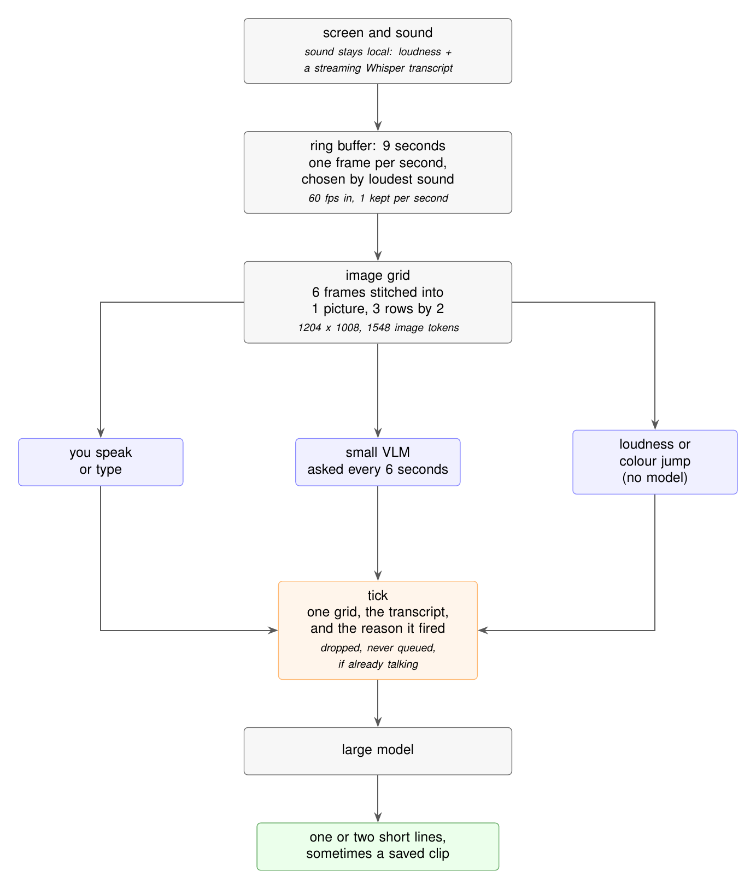

# Backseat

**STILL IN DEVELOPMENT NOT TESTED**

A live AI video pipeline that decides what is interesting enough to comment on,
so a character can watch you play and talk about it without talking constantly.

Extracted from [Sei](https://github.com/sei-studio/sei). This is the real
implementation, but it is not a standalone app: it expects an Electron host with
a chat brain, a character persona, and a memory store.

## Architecture



<sub>Diagram source: [`docs/architecture.tex`](docs/architecture.tex) (TikZ). Rebuild with `tectonic docs/architecture.tex && pdftoppm -png -r 200 -singlefile docs/architecture.pdf docs/architecture`.</sub>

**Ring buffer.** Capture runs at 60 fps but only one frame per second is kept,
chosen by which frame had the loudest sound. It is a running argmax, so one image
is held and one is compressed per second instead of 60, while still examining
every frame. 9 seconds is one grid plus latency slack.

**Image grid.** Still image models cannot watch video, so 6 frames are stitched
into one picture and the model is told to read them in order. Layout, frame count
and ordering follow the IG-VLM paper: 6 frames beat 4, 9, 12, 16 and 20, and near
square grids beat wide ones. The grid is 1204 by 1008 pixels, which is 1548 image
tokens, the largest that fits Claude Haiku 4.5 without being silently downscaled.

**Sound is gain plus transcript, never the model's ears.** Screen audio has two
consumers, both local: the loudness signal (frame choice and the jolt trigger)
and a streaming transcript from a small local Whisper model. No audio bytes
reach a remote model. Whisper chews 3 second chunks continuously into a ring of
timed segments, so when a tick fires it only waits a bounded moment for the
in-progress tail (1.2 s cap) instead of transcribing 6 seconds on demand. The
window's text rides the tick to both the small VLM and the big model, framed as
quoted game audio: never the player, never instructions.

**Three triggers.** All three produce the same thing, a *tick*: one grid, the
transcript over its window, and the reason it fired.

1. You spoke or typed. Always answered. The grid is captured at the moment you
   start, not when you finish, so the character sees what you reacted to.
2. A small VLM is asked every 6 seconds whether something significant happened.
3. A large jump in loudness or screen colour, with no model in the loop.

Triggers 2 and 3 are dropped, never queued, if the character is already thinking
or spoke less than 8 seconds ago.

**Learned threshold.** A fixed cutoff does not work: small vision models say yes
to almost anything. The gate reads the probability of the answer token and sets
its cutoff at the upper quartile of the last 40 scores in the session, so each
game is judged against its own normal. Measured on a static grid versus a
changing grid, the model emitted "no" for both while the scores separated 0.018
against 0.148, so the continuous score is what makes it work at all.

**Capturing sound.** Windows uses Chromium's desktop loopback. On macOS that
returns digital silence (measured, not read), but the OS itself is fine, which
is how OBS records desktop audio: ScreenCaptureKit. So macOS ships a small
Swift helper inside the app that captures system audio through
ScreenCaptureKit and streams PCM to the renderer. It needs no install and no
new permission (it rides the Screen Recording grant the picker already
required), and it excludes the app's own audio so the companion never hears
its own voice. Fallback order: Windows loopback, the mac helper, a virtual
audio device such as BlackHole, then video only. Without sound, frame choice
falls back to the last frame of each second, the loudness trigger never fires,
and there is no transcript. The grid and the small VLM are purely visual and
unaffected.

## Files

| Path | Role |
| --- | --- |
| `src/shared/backseatIpc.ts` | Constants and the contract between both halves |
| `src/renderer/lib/backseat/captureWorker.ts` | Ring buffer, frame choice, jolt detection, grid building |
| `src/renderer/lib/backseat/captureController.ts` | Screen and sound capture, clip recorders, trigger timing |
| `src/renderer/lib/backseat/pcm.ts` | Downmix, resample, loudness. Pure and tested |
| `src/renderer/lib/backseat/transcriptRing.ts` | Transcript segments, window selection, dispatch policy. Pure and tested |
| `src/renderer/lib/backseat/sttStream.ts` | Streaming Whisper over the PCM feed, bounded flush at tick time |
| `src/main/backseat/audioTap.ts` | Spawns the mac helper, relays its PCM to the renderer |
| `native/mac-audio-tap/main.swift` | ScreenCaptureKit system audio capture, built by `scripts/build-mac-audio-tap.sh` |
| `src/main/backseat/salienceGate.ts` | Small VLM and the learned threshold |
| `src/main/backseat/backseatService.ts` | Decides which ticks become speech, runs the large model |
| `src/main/backseat/backseatPrompts.ts` | Grid explanation and reply style |
| `src/main/backseatOverlay.ts` | Always on top window, which also owns capture |
| `src/renderer/components/backseat/` | Share picker, overlay, clip card |

Capture lives in the overlay window, not the main app window, because a hidden
window has its timers throttled and the main window is hidden during a full
screen game.

`sttStream.ts` expects the host to provide a Whisper worker (in Sei it is the
same one voice calls use, `voice/whisperWorker.ts`: transformers.js, wasm, q8),
so the model downloads once and is shared between features.

## Quickstart

These files drop into an Electron app. To wire them up:

1. Copy `src/` into your project and point the imports at your own chat brain,
   character store, and memory store. `backseatService.ts` is the only file that
   touches them.
2. Register the IPC channels listed at the bottom of `src/shared/backseatIpc.ts`.
3. Add the Chromium switches for system audio in your main process:

   ```js
   app.commandLine.appendSwitch(
     'enable-features',
     'MacSckSystemAudioLoopbackOverride,MacLoopbackAudioForScreenShare',
   );
   ```

4. Set `backgroundThrottling: false` on any window that runs capture.
5. Export a DeepInfra key for the gate. Without it the gate fails closed and
   only triggers 1 and 3 run.

   ```sh
   export SEI_GATE_DEV_KEY=...
   export SEI_GATE_MODEL=Qwen/Qwen3-VL-30B-A3B-Instruct   # optional
   ```

Model choice was measured, not assumed. On DeepInfra, `Qwen3-VL-30B-A3B` answered
correctly on both test grids at about 520 ms and $0.00019 per call, which is about
$0.11 per hour at the 6 second cadence. `gemma-3-4b-it` said yes to everything and
`gemma-3-12b-it` said no to everything.

Run the tests with `vitest`.

## Sources

- Wonkyun Kim et al., *An Image Grid Can Be Worth a Video: Zero-shot Video
  Question Answering Using a VLM*, arXiv:2403.18406.
  https://arxiv.org/abs/2403.18406
- Anthropic, image sizing and token cost.
  https://platform.claude.com/docs/en/build-with-claude/vision
- Electron, `setDisplayMediaRequestHandler`, which documents loopback audio as
  Windows only. https://www.electronjs.org/docs/latest/api/session
- Electron issue 47490, macOS loopback audio.
  https://github.com/electron/electron/issues/47490

## License

AGPL-3.0-or-later, same as [Sei](https://github.com/sei-studio/sei). See
[LICENSE](LICENSE).
